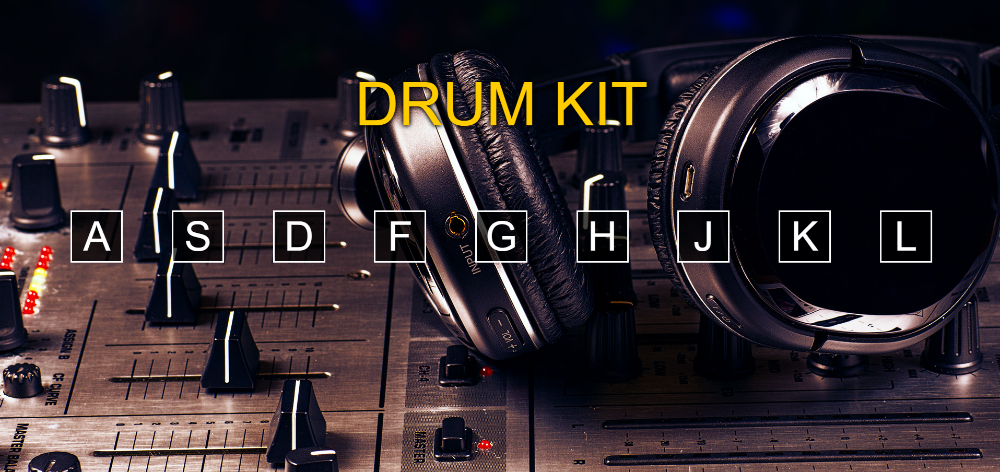

# Drumkit

Projeto simples desenvolvido com HTML, CSS e Javascript que apresenta um conjunto de teclas que tocam som ao serem clicadas. Tem como objetivo a manipulação do DOM usando suas propriedades e eventos.

